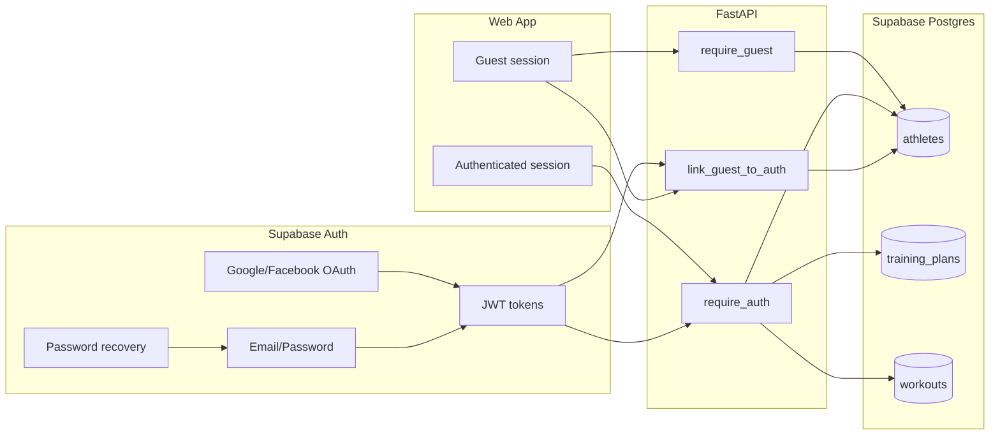
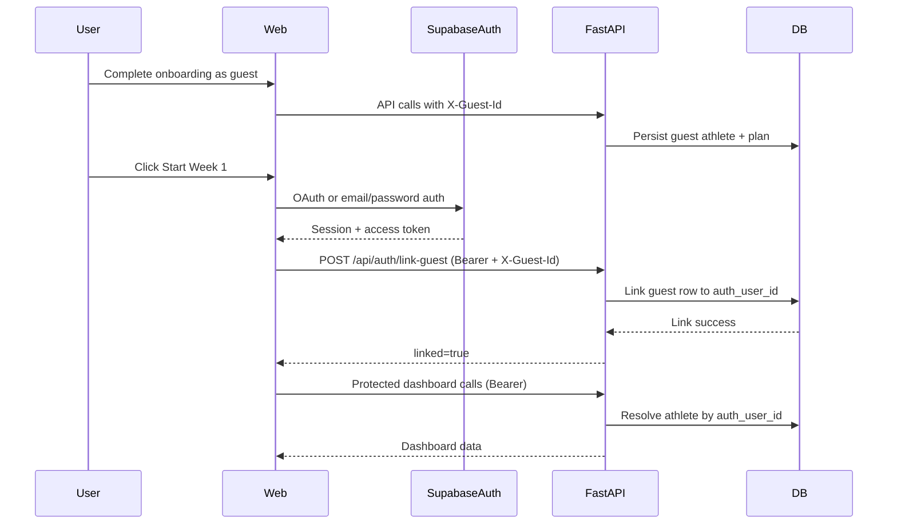

# ADR-015: Authentication System (Hybrid Guest + Account)

**Status:** Proposed  
**Date:** 2026-06-14  
**Owners:** Engineering  
**Supersedes:** Extends ADR-006 (anonymous-first identity)

---

## 1) Context

The product currently runs with anonymous guest identity:

- Frontend persists `guestId` in local storage.
- API identity is primarily `X-Guest-Id`.
- `athletes` table stores guest rows and has a reserved `auth_user_id` column.
- Landing "Log in" button is currently non-functional.

This model optimizes early funnel conversion, but it does not provide durable identity for cross-device continuity, password recovery, or future entitlements.

We need a production auth system that:

1. Preserves anonymous-first onboarding.
2. Adds account identity (social + password).
3. Links guest data to authenticated identity safely.
4. Adds route and API protection for dashboard features.
5. Is implementable in incremental steps without breaking current flows.

---

## 2) Decision

Adopt a **hybrid auth architecture** with **Supabase Auth** as identity provider:

- Allow guest onboarding and plan preview.
- Require authenticated identity for dashboard/protected operations.
- Support Google + Facebook OAuth and email/password credentials.
- Add forgot/reset password.
- On first authenticated session, link `guest_id` data to `auth_user_id`.

This is a direct continuation of ADR-006 phase-2 direction, with concrete implementation, security controls, and rollout sequencing.

---

## 3) Goals and non-goals

### Goals

- Preserve no-signup onboarding.
- Enable reliable account login across devices.
- Support social login and password recovery.
- Keep backend as policy-enforcement point for protected data access.
- Provide a clear handoff spec for both humans and autonomous coding agents.

### Non-goals

- Implement billing/paywall.
- Implement org/team identity.
- Fully migrate to strict DB-level RLS user-only access in this phase.

---

## 4) Technical considerations and trade-offs

### 4.1 Why Supabase Auth here

**Pros**

- Already aligned with existing Supabase deployment and schema.
- Supports Google/Facebook OAuth + email/password + recovery.
- Reduces integration footprint for a small team.
- Works with web now and iOS later.

**Cons**

- Requires custom login UI (not prebuilt like Clerk).
- Still needs careful JWT verification and route partitioning.
- Requires provider console setup (Google/Meta).

### 4.2 Why not social-only

A requested forgot-password flow implies credential-based login.  
Therefore auth scope includes both:

- Social OAuth
- Email/password + reset

### 4.3 Why keep hybrid mode

Forcing login before onboarding adds friction and risks conversion drop.  
Hybrid keeps funnel speed while providing account durability at the dashboard boundary.

### 4.4 API-first enforcement model

Even though Supabase can enforce DB policies, the current architecture is API-first.  
Decision: perform auth checks in FastAPI dependencies first, then progressively harden DB policy later.

---

## 5) Target architecture

---

## 6) Data model and migration strategy

### Current schema

`athletes.auth_user_id UUID REFERENCES auth.users(id)` already exists.

### Decision for this phase

- Keep existing column and FK (no immediate schema rename).
- Add backend store methods for:
  - lookup by `auth_user_id`
  - linking `guest_id -> auth_user_id`
- Preserve guest records for pre-auth flows.

### Future-compatible option (deferred)

If provider changes later, migrate to provider-agnostic identity key:

- `external_user_id TEXT`
- `auth_provider TEXT`

Not required for this phase.

---

## 7) Route access policy

### Public/guest endpoints

- Guest bootstrap and onboarding:
  - `POST /api/guests`
  - onboarding chat/generate preview endpoints

Identity accepted: `X-Guest-Id` (guest required or optional depending endpoint).

### Protected endpoints

- Dashboard/profile/plan operations:
  - `GET /api/athletes/me`
  - activate and dashboard data endpoints

Identity required: `Authorization: Bearer <jwt>`.

### Bridging endpoint

- `POST /api/auth/link-guest`

Identity required: both guest and auth context.

---

## 8) Security and reliability considerations

### JWT verification

- Verify signature with Supabase JWT configuration.
- Validate standard claims:
  - `exp` (not expired)
  - `sub` (user id)
  - `aud` when configured
- Reject malformed or unsigned tokens with 401.

### Guest-link safety

- Linking operation must be idempotent.
- Ensure guest row exists.
- If `auth_user_id` already linked to same athlete: return success.
- If target auth id linked to a different athlete:
  - return conflict (409) in v1 (merge deferred).

### Password reset

- Always show non-enumerating success response.
- Do not reveal whether email exists.

### Observability

Emit structured auth events:

- `auth_login_success`
- `auth_login_failed`
- `auth_link_guest_success`
- `auth_link_guest_conflict`
- `auth_password_reset_requested`
- `auth_password_reset_completed`

---

## 9) Frontend implementation plan

### 9.1 New components/pages

- `AuthLayout` (split-screen image + form panel)
- `TextInput`
- `SocialButtons`
- `LoginPage`
- `SignUpPage`
- `ForgotPasswordPage`
- `ResetPasswordPage`
- `AuthCallbackPage`
- `RequireAuth`

### 9.2 Route changes

Add routes:

- `/login`
- `/signup`
- `/forgot-password`
- `/reset-password`
- `/auth/callback`

Protect `/dashboard/*` with `RequireAuth`.

### 9.3 Session and API headers

- Keep `X-Guest-Id` for onboarding calls.
- Add bearer token for protected API calls.
- Ensure API utility can select header strategy by endpoint class.

### 9.4 UX details

- Preserve `next` redirect query parameter.
- Show inline error states for auth failures.
- Password visibility toggle on password inputs.
- Maintain mobile parity (split layout collapses to single pane).

---

## 10) Backend implementation plan

### 10.1 Dependencies and config

- Add JWT verification support (e.g. `PyJWT`).
- Ensure required env vars are documented:
  - `SUPABASE_URL`
  - `SUPABASE_SERVICE_KEY`
  - `SUPABASE_JWT_SECRET` (or equivalent verification method)

### 10.2 Dependency layer (`api/deps.py`)

Add:

- `require_auth()` -> returns `auth_user_id`
- `require_auth_athlete()` -> resolves athlete by auth identity
- Keep `require_guest()` for guest paths

### 10.3 New endpoint

`POST /api/auth/link-guest`:

Request:

- Header: bearer JWT
- Header: `X-Guest-Id`

Response:

- `{ athleteId, linked: true }` on success

Failure modes:

- 401 invalid/missing auth
- 404 guest not found
- 409 auth already linked to another athlete

### 10.4 Persistence layer

Add store methods:

- `get_athlete_by_auth_user(auth_user_id)`
- `link_guest_to_auth(guest_id, auth_user_id)`

Use transactions/atomic updates where supported.

---

## 11) End-to-end sequence (reference)

---

## 12) Edge cases and expected behavior

1. **No guest id present when user logs in from landing**
   - If athlete exists by `auth_user_id`, go dashboard.
   - Else route to onboarding.

2. **Guest id exists but guest row missing**
   - Return 404 from link endpoint, then create/recover path in client (log and route onboarding).

3. **User switches accounts while guest id remains**
   - Link endpoint enforces conflict checks; do not silently overwrite.

4. **Expired JWT**
   - Return 401; frontend refreshes session or routes login.

5. **Password reset for unknown email**
   - Return generic success UI.

---

## 13) Testing strategy

### Unit

- JWT parser/validator claim tests.
- Linking conflict and idempotency logic.

### Integration

- Guest onboarding + first auth link.
- Returning auth user without guest id.
- Protected endpoint access control.

### E2E (web)

- Login via social route.
- Sign up via password.
- Forgot/reset password.
- Redirect behavior using `next`.

### Regression checks

- Existing guest-only onboarding flow still works until auth gate.

---

## 14) Rollout plan

1. Ship frontend auth pages behind route availability.
2. Ship backend auth dependencies and link endpoint.
3. Enable dashboard route guard.
4. Enable social providers in Supabase dashboard.
5. Verify production callbacks and password reset URLs.
6. Monitor auth funnel + error metrics for 1 week.

---

## 15) Implementation checklist (agent-ready)

### Provider setup

- [ ] Configure Google OAuth provider in Supabase.
- [ ] Configure Facebook OAuth provider in Supabase.
- [ ] Confirm allowed redirect URLs for local + production.
- [ ] Confirm email provider settings and recovery redirect.

### Frontend

- [ ] Add Supabase client wrapper.
- [ ] Add auth context/provider.
- [ ] Add auth pages and shared components.
- [ ] Add callback page and routing.
- [ ] Add route guard.
- [ ] Wire landing/onboarding entry points to auth routes.
- [ ] Add error and loading states.

### Backend

- [ ] Add JWT auth dependencies.
- [ ] Add link-guest endpoint.
- [ ] Add store methods and conflict handling.
- [ ] Partition endpoints into guest vs protected.
- [ ] Add auth-related logging.

### Validation

- [ ] Run manual E2E checklist.
- [ ] Confirm no onboarding regressions.
- [ ] Confirm 401/409 handling paths in UI.

---

## 16) Consequences

### Positive

- Maintains conversion-friendly onboarding while adding durable accounts.
- Enables cross-device continuity and password recovery.
- Creates clean path for future entitlements and paid features.

### Negative

- Additional auth complexity in frontend state + backend dependencies.
- Requires careful guest/auth transition handling and error UX.

---

## 17) References

- `docs/Auth/PRD-Auth-flow.md`
- `docs/Main/ADR.md` (ADR-006 baseline)
- `web/src/lib/guest.ts`
- `web/src/lib/api.ts`
- `coaching-lab/api/deps.py`
- `supabase/migrations/001_initial_schema.sql`

