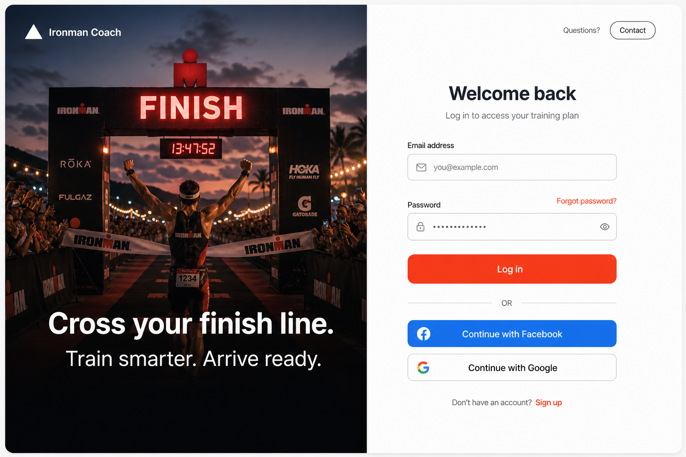
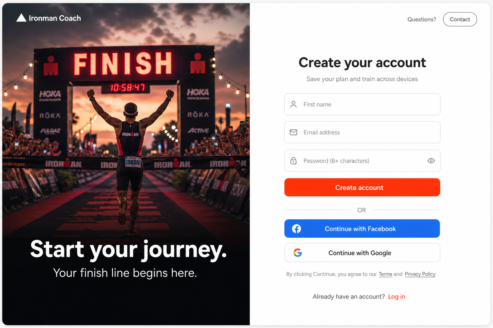
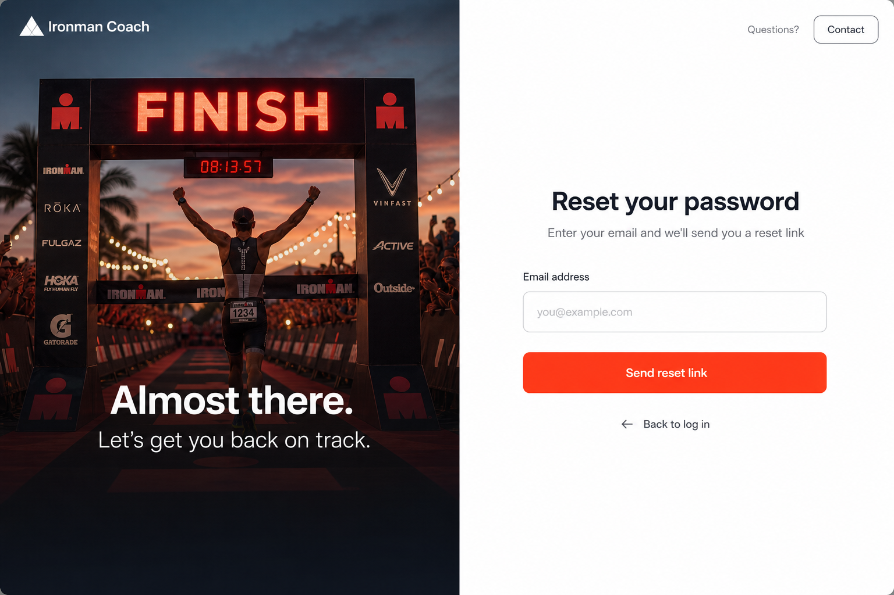

# Product Requirements Document (PRD)
## Authentication Flow (Social + Password)

**Product:** Nayth's Ironman Coach  
**Status:** Draft for implementation  
**Owner:** Product + Engineering  
**Last updated:** 2026-06-14

---

## 1) Problem statement

The current app is anonymous-first and uses `guestId` in local storage plus `X-Guest-Id` headers. This is great for low-friction onboarding, but it has limits:

- Users cannot reliably access plans across devices unless they stay on the same browser.
- There is no secure account identity for long-term data ownership and future paid features.
- The existing "Log in" affordance is non-functional.
- Password recovery does not exist, which blocks email/password account use.

We need an auth system that preserves the existing fast onboarding experience while enabling durable user accounts and cross-device continuity.

---

## 2) What we propose to build and why

### Proposed solution

Build a **hybrid auth flow**:

- Keep anonymous onboarding and plan preview as-is.
- Require authentication before entering protected dashboard flows.
- Support:
  - Social login: **Google** and **Facebook**
  - Email/password sign-up and login
  - Forgot/reset password
- Link existing guest data to the authenticated account on first login.

### Why this approach

- Preserves current conversion strength (users can try before signup).
- Enables secure identity and device portability.
- Aligns with existing architecture and schema (`athletes.auth_user_id` already exists).
- Gives both low-friction social auth and fallback password auth.

### In-scope

- New frontend auth pages: Login, Sign up, Forgot password, Reset password.
- Auth callback handling.
- Guest-to-account linking endpoint and logic.
- Route protection for dashboard pages.
- API auth headers for protected routes.

### Out-of-scope

- Subscription/paywall UX.
- Organization/team features.
- Native mobile UI implementation (web-only for now).

---

## 3) User experience requirements

### Primary user journeys

1. **New user (guest-first)**
   - User completes onboarding as guest.
   - Clicks "Start week 1" or tries to open dashboard.
   - User signs up/logs in.
   - Guest profile/plan is linked to account.
   - User lands in dashboard with same plan context.

2. **Returning user**
   - User clicks "Log in" from landing.
   - User authenticates with social or email/password.
   - User lands in dashboard directly.

3. **Password recovery**
   - User opens forgot-password page.
   - Enters email and receives reset link.
   - User sets a new password on reset page.
   - User can log in successfully.

### Functional requirements

- Login supports:
  - Google OAuth
  - Facebook OAuth
  - Email + password
- Sign up supports:
  - Google/Facebook OAuth
  - Email + password (+ optional first name field)
- Forgot password sends reset email.
- Reset password updates password via auth provider recovery context.
- Authenticated routes redirect unauthenticated users to login with `next` param.
- Guest link is idempotent and safe to retry.

### Success criteria

- 100% of protected routes require valid auth.
- Guest plans survive first-time account creation/login.
- Password reset flow completes end-to-end without manual support.

---

## 4) Designs

### Design system constraints

Use existing app style:

- Background: `#FAFAF8`
- Primary action: `#FF5436`
- Existing `Logo`, `Button`, spacing, rounded corners, muted text tokens
- Inter font

### Layout format

Use a **split-screen auth layout** (desktop):

- **Left panel:** full-height finish-line image with dark overlay, white logo, motivational headline.
- **Right panel:** form column on white background with optional "Questions? Contact" affordance.
- **Mobile:** hide left image panel; keep right panel full width.

### Design content by page

#### Login page (`/login`)

- Title: "Welcome back"
- Fields: email, password
- Link: "Forgot password?"
- Primary CTA: "Log in"
- Divider: "OR"
- Social CTAs:
  - Continue with Facebook
  - Continue with Google
- Footer: "Don't have an account? Sign up"

#### Sign up page (`/signup`)

- Title: "Create your account"
- Fields: first name (optional), email, password
- Primary CTA: "Create account"
- Divider: "OR"
- Social CTAs: Facebook, Google
- Legal copy below social CTAs
- Footer: "Already have an account? Log in"

#### Forgot password page (`/forgot-password`)

- Title: "Reset your password"
- Field: email
- CTA: "Send reset link"
- Secondary link: "Back to log in"
- Post-submit success state confirms email dispatch (without revealing account existence).

#### Reset password page (`/reset-password`)

- Title: "Choose a new password"
- Fields: new password, confirm password
- CTA: "Update password"
- Success state redirects to login/dashboard based on session state.

### Design references in this PRD

Implementation should follow the split-screen composition documented in this repository's auth plan and align with these reference mockups:

---

## 5) Acceptance checklist

- [ ] All four pages implemented and routed.
- [ ] UI matches existing design language and spacing.
- [ ] Social + password auth both work.
- [ ] Forgot/reset flow works.
- [ ] Dashboard routes are guarded.
- [ ] Guest link succeeds on first authenticated entry.

---

## 6) Handoff notes

This PRD intentionally stays slim and execution-focused.  
For architecture, security, data migration, API contracts, and implementation sequencing, use:

- `docs/Auth/ADR0Auth-Flow.md`

