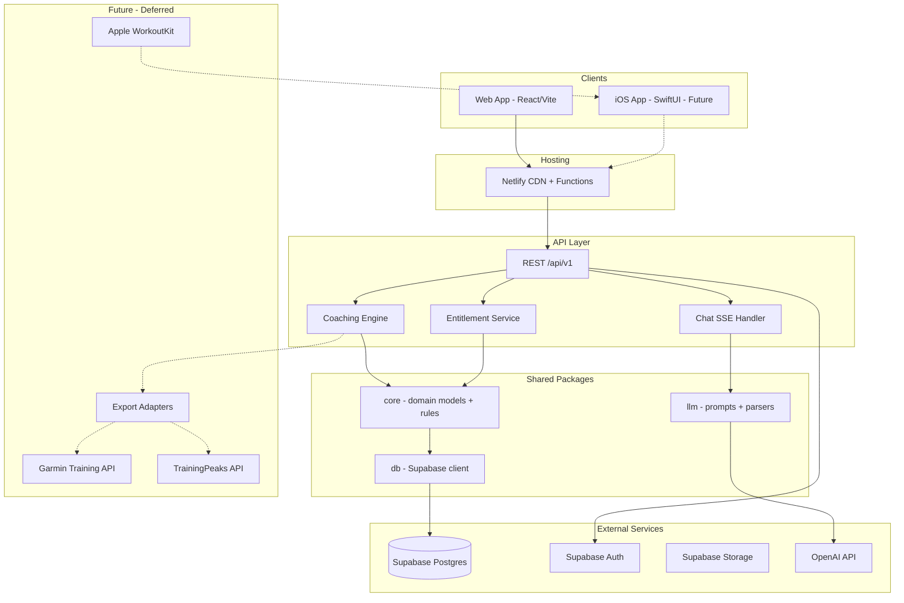
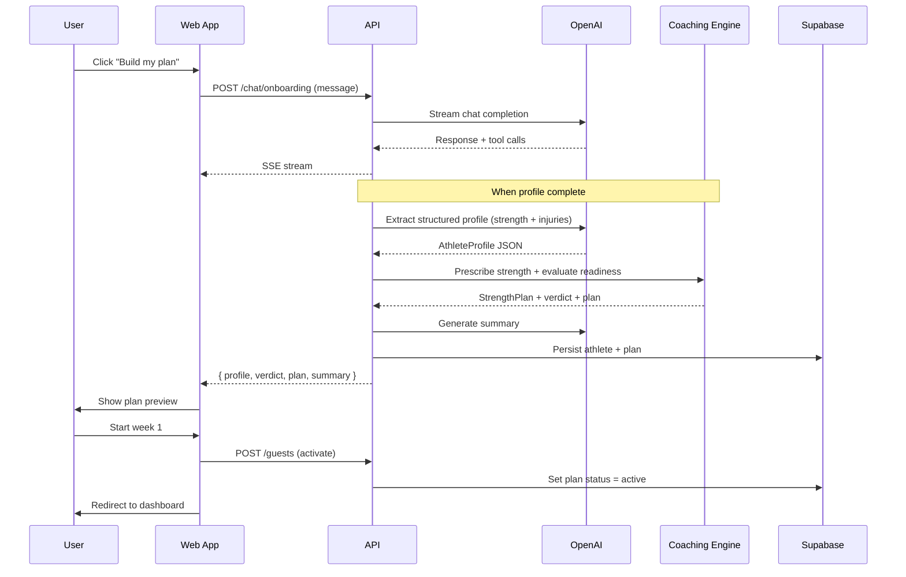

# Architecture Decision Record (ADR)
## Nayth's Ironman Coach — Technical Architecture

**Version:** 1.1  
**Date:** 13 June 2026  
**Status:** Proposed

This document records the architectural decisions for implementing the Nayth's Ironman Coach web application. It is written to support a **web-first MVP** while ensuring native mobile (iOS SwiftUI companion) and device integrations (Garmin, TrainingPeaks, Apple WorkoutKit) can be layered in later without fundamental rework.

**Focused auth ADR:** `docs/Auth/ADR0Auth-Flow.md`

---

## ADR Index

| ID | Decision | Status |
|----|----------|--------|
| ADR-001 | Monorepo with API-first backend | Proposed |
| ADR-002 | Supabase as shared backend | Proposed |
| ADR-003 | React + TypeScript + Vite for web | Proposed |
| ADR-004 | Netlify for web hosting | Proposed |
| ADR-005 | Canonical workout domain model | Proposed |
| ADR-006 | Anonymous-first identity with auth-ready layer | Proposed |
| ADR-007 | Entitlement service for future paywall | Proposed |
| ADR-008 | LLM orchestration architecture | Proposed |
| ADR-009 | Coaching engine: rules + LLM hybrid | Proposed |
| ADR-010 | Mobile-ready API contract | Proposed |
| ADR-011 | Device integration adapter pattern (deferred) | Proposed |
| ADR-012 | Client state and offline strategy | Proposed |
| ADR-013 | OpenAI as LLM provider | Proposed |
| ADR-014 | Strength prescription from onboarding profile | Proposed |

---

## ADR-001: Monorepo with API-First Backend

### Context

The product will eventually have:
- A web app (MVP)
- A native iOS companion app (SwiftUI)
- Background jobs for plan generation, adaptation, and device sync

Building the web app as a standalone frontend that talks directly to Supabase from the browser would be fastest initially but creates problems when adding mobile (exposes DB patterns to multiple clients), LLM orchestration (API keys in browser), and device exporters (server-side only).

### Decision

Use a **monorepo** with a clear separation:

```
nayths-ironman-coach/
├── apps/
│   └── web/                 # React SPA (MVP focus)
├── packages/
│   ├── api/                 # Shared API route handlers / serverless functions
│   ├── core/                # Domain models, coaching rules, validators
│   ├── llm/                 # Prompt templates, structured output parsers
│   └── db/                  # Supabase client, migrations, generated types
├── supabase/
│   └── migrations/
└── docs/
```

All clients (web now, iOS later) talk to a **single HTTP API layer**. The web app does not call Supabase directly for write operations involving LLM or coaching logic.

### Consequences

**Positive:**
- iOS app can consume the same REST endpoints on day one when built
- API keys and coaching logic stay server-side
- Device export adapters live in one place

**Negative:**
- Slightly more setup than direct Supabase-from-browser
- Netlify Functions or Supabase Edge Functions add cold-start latency

### Mobile layering note

When the iOS app ships, it becomes `apps/ios/` in the same monorepo (or a sibling repo sharing `packages/core`). It calls the identical API base URL. No web-specific assumptions in the API.

---

## ADR-002: Supabase as Shared Backend

### Context

Prior sessions evaluated Supabase vs Firebase vs custom backend. Nayth's Ironman Coach needs:
- Relational data (plans, workouts, phases, completions — highly structured)
- Auth (deferred but needed for accounts/paywall)
- Row-level security
- File storage (future: export files, profile images)
- Realtime (future: live chat, sync status)

### Decision

**Supabase (Postgres + Auth + Storage + Edge Functions)** is the system of record.

| Concern | Implementation |
|---------|----------------|
| Database | Postgres via Supabase |
| Migrations | `supabase/migrations/` in repo |
| Types | Generated TypeScript types from schema |
| Auth | Supabase Auth (disabled in MVP UI; schema ready) |
| RLS | Policies per `athlete_id`; anonymous profiles use `guest_id` until linked |
| Storage | `exports/` bucket for future FIT/ICS files |

### Alternatives considered

| Option | Rejected because |
|--------|------------------|
| Firebase | Weaker fit for relational plan/workout schema |
| Custom Node server | Unnecessary ops burden for MVP |
| Direct Postgres on Railway | Loses auth, RLS, storage integrations |

### Mobile layering note

Supabase provides an official Swift SDK. The iOS app *could* read data directly, but per ADR-001 it should prefer the API layer for coaching/LLM operations. Direct Supabase reads are acceptable later for offline caching.

---

## ADR-003: React + TypeScript + Vite for Web

### Context

Design mockups target a modern SaaS aesthetic (autosend.com / Linear). The team will build primarily in Cursor. Fast iteration and component reuse matter.

### Decision

| Layer | Choice |
|-------|--------|
| Framework | React 19 + TypeScript |
| Build | Vite |
| Routing | React Router v7 |
| Styling | Tailwind CSS v4 |
| Components | Headless UI or Radix primitives + custom design tokens |
| Charts | Recharts (training load timeline) |
| Forms | React Hook Form + Zod |
| Data fetching | TanStack Query |
| Testing | Vitest + React Testing Library |

**MVP UI note:** The landing page **Log in** button is a visual placeholder only (`onClick` is a no-op). No auth route, modal, or navigation is wired until accounts ship in a later phase.

### Alternatives considered

| Option | Rejected because |
|--------|------------------|
| Next.js | SSR not needed for authenticated dashboard MVP; adds complexity on Netlify |
| Vue/Svelte | Less ecosystem alignment with future React Native option |

### Mobile layering note

If a cross-platform mobile app is ever preferred over native Swift, React Native + Expo could share TypeScript types from `packages/core`. Native Swift remains the stated plan; this stack does not block either path.

---

## ADR-004: Netlify for Web Hosting

### Context

Earlier sessions specified Netlify. The web app is a SPA with API calls to serverless functions.

### Decision

| Concern | Implementation |
|---------|----------------|
| Hosting | Netlify |
| Deploy | GitHub integration, deploy previews per PR |
| API | Netlify Functions (or Supabase Edge Functions for LLM routes) |
| Env vars | Netlify dashboard for `SUPABASE_URL`, `SUPABASE_SERVICE_KEY`, `OPENAI_API_KEY` |
| Redirects | SPA fallback in `netlify.toml` |
| CDN | Netlify edge |

```toml
# netlify.toml (illustrative)
[build]
  command = "pnpm --filter web build"
  publish = "apps/web/dist"

[[redirects]]
  from = "/api/*"
  to = "/.netlify/functions/:splat"
  status = 200

[[redirects]]
  from = "/*"
  to = "/index.html"
  status = 200
```

### Mobile layering note

The API base URL is an environment variable (`VITE_API_URL`). iOS will use the same production URL. No Netlify-specific logic in domain code.

---

## ADR-005: Canonical Workout Domain Model

### Context

Future integrations require exporting to Garmin Training API, TrainingPeaks Partner API, Apple WorkoutKit, and file formats (FIT, ZWO). Each has a different schema. Prior research established that making any vendor format the source of truth creates painful lock-in.

### Decision

Define an internal **canonical workout model** in `packages/core` that all systems translate through.

```typescript
// packages/core/src/workout.ts (illustrative)

type Sport = 'swim' | 'bike' | 'run' | 'strength' | 'brick' | 'other';

type WorkoutStepType =
  | 'warmup' | 'work' | 'recovery' | 'rest' | 'cooldown' | 'repeat';

type TargetType = 'pace' | 'power' | 'heart_rate' | 'rpe' | 'cadence' | 'open';

interface WorkoutTarget {
  type: TargetType;
  min?: number;
  max?: number;
  unit?: string;
}

interface WorkoutStep {
  id: string;
  type: WorkoutStepType;
  name?: string;
  durationSeconds?: number;
  distanceMeters?: number;
  target?: WorkoutTarget;
  notes?: string;
  repeatCount?: number;
  steps?: WorkoutStep[];  // nested for repeat blocks
}

interface Workout {
  id: string;
  sport: Sport;
  title: string;
  description?: string;
  scheduledDate: string;       // ISO date
  purposeTag: PurposeTag;
  isKeySession: boolean;
  steps: WorkoutStep[];
  estimatedDurationSeconds?: number;
  estimatedDistanceMeters?: number;
  estimatedTss?: number;
  fuelingNotes?: string;
  status: 'planned' | 'completed' | 'skipped' | 'adapted';
}

type PurposeTag =
  | 'aerobic_base' | 'durability' | 'threshold' | 'vo2' | 'economy'
  | 'fueling' | 'race_execution' | 'recovery' | 'strength';
```

**Rules:**
- Plan generation writes canonical model only
- API returns canonical model; clients render it
- Export adapters read canonical → vendor format (future)
- Import adapters (future) normalize vendor → canonical

### Mobile layering note

The iOS app receives the same `Workout` JSON from the API and maps it to Swift structs. A `WorkoutKitExporter` in Swift converts canonical → `WorkoutPlan` when that integration ships.

---

## ADR-006: Anonymous-First Identity with Auth-Ready Layer

### Context

MVP is free with no forced signup. Future versions need accounts (cross-device sync, paywall, device linking). Building without identity infrastructure creates migration pain.

### Decision

**Two-phase identity:**

**Phase 1 (MVP):**
```typescript
interface GuestProfile {
  guestId: string;          // UUID generated client-side, stored localStorage
  createdAt: string;
  profile: AthleteProfile;
  plan: TrainingPlan;
}
```
- `guestId` sent as `X-Guest-Id` header on all API calls
- Server upserts guest record in `athletes` table with `auth_user_id = null`
- Optional "Save my plan" prompts email capture (no password)

**Phase 2 (Accounts):**
- Supabase Auth (magic link or OAuth)
- On signup: link `guestId` → `auth_user_id` (merge data)
- JWT replaces guest header

**Database:**
```sql
CREATE TABLE athletes (
  id            UUID PRIMARY KEY DEFAULT gen_random_uuid(),
  guest_id      UUID UNIQUE,
  auth_user_id  UUID REFERENCES auth.users(id),
  created_at    TIMESTAMPTZ DEFAULT now(),
  -- profile fields...
);
```

### Consequences

RLS policies must handle both `guest_id` and `auth_user_id` lookups. Service role used in API layer during MVP to simplify; tightened when auth ships.

### Mobile layering note

iOS app uses Supabase Auth from day one (Keychain token storage). Guest mode can exist on web only. When a web guest signs up, mobile login sees the same data.

---

## ADR-007: Entitlement Service for Future Paywall

### Context

MVP is free, but features like device sync, unlimited chat, and advanced analytics are natural premium candidates. Hard-coding "everything free" creates rework.

### Decision

Implement a lightweight entitlement check from day one:

```typescript
// packages/core/src/entitlements.ts

type Tier = 'free' | 'pro' | 'coach';
type Feature =
  | 'plan_generation'
  | 'coach_chat'
  | 'adaptation_engine'
  | 'device_sync'        // future
  | 'advanced_analytics' // future
  | 'export_fit';        // future

const TIER_FEATURES: Record<Tier, Feature[]> = {
  free: ['plan_generation', 'coach_chat', 'adaptation_engine'],
  pro:  [/* all free + */ 'device_sync', 'advanced_analytics', 'export_fit'],
  coach: [/* all pro + */],
};

function hasEntitlement(tier: Tier, feature: Feature): boolean {
  return TIER_FEATURES[tier].includes(feature);
}
```

- MVP: all users `tier = 'free'`, all MVP features pass
- API middleware logs `feature_accessed` events for future packaging decisions
- Paywall UI is a no-op stub returning `allowed: true`

### Mobile layering note

iOS app checks entitlements via `GET /api/v1/entitlements` — same response shape. StoreKit subscriptions update `tier` server-side later.

---

## ADR-008: LLM Orchestration Architecture

### Context

LLM is used in two places:
1. **Onboarding coach chat** — multi-turn intake, structured profile extraction (including strength background and injury history)
2. **Dashboard coach chat** — Q&A with plan context

API keys must not live in the browser. Outputs must be structured enough to generate plans reliably.

### Decision

**LLM provider: OpenAI** (server-side only via `OPENAI_API_KEY`).

| Use case | Suggested model | Notes |
|----------|-----------------|-------|
| Onboarding chat | `gpt-4o` | Multi-turn conversation, nuanced follow-ups on strength/injuries |
| Profile extraction | `gpt-4o` with structured output | Zod-validated JSON response |
| Plan summary narration | `gpt-4o-mini` | Lower cost; deterministic plan already generated |
| Dashboard coach chat | `gpt-4o` | Needs plan context reasoning |

SDK: `openai` npm package with streaming via SSE to the web client.

```
┌─────────────┐     ┌──────────────────┐     ┌─────────────┐
│  Web Chat   │────▶│  POST /api/chat  │────▶│   OpenAI    │
│  UI         │◀────│  (streaming SSE) │◀────│  (gpt-4o)   │
└─────────────┘     └────────┬─────────┘     └─────────────┘
                             │
                    ┌────────▼─────────┐
                    │ packages/llm     │
                    │ - system prompts │
                    │ - tool schemas   │
                    │ - output parsers │
                    └────────┬─────────┘
                             │
                    ┌────────▼─────────┐
                    │ packages/core    │
                    │ plan generator   │
                    │ readiness rules  │
                    └──────────────────┘
```

**Onboarding flow:**
1. Chat collects data over multiple turns (including strength background and injury history)
2. When sufficient fields present, API calls `extractProfile(chatHistory)` → structured `AthleteProfile`
3. Strength prescription rules (deterministic) derive `strengthPlan` from profile
4. Readiness rules (deterministic) evaluate profile → verdict
5. Plan generator (deterministic, template + rules) produces `TrainingPlan` including strength sessions
6. OpenAI generates human-readable summary tying outputs to conversation specifics
7. Return `{ profile, strengthPlan, verdict, plan, summary }` to client

**Key principle:** LLM handles language; **deterministic code owns training load decisions**.

### Structured output example

```typescript
// Onboarding extraction schema (Zod)
const AthleteProfileSchema = z.object({
  goalType: z.enum(['finish', 'pr', 'return']),
  raceName: z.string(),
  raceDate: z.string().date(),
  weeklyHours: z.number().min(3).max(30),
  limiterDiscipline: z.enum(['swim', 'bike', 'run']),
  injuryFlags: z.array(z.string()),
  strengthBackground: z.enum(['none', 'beginner', 'intermediate', 'experienced']),
  strengthEquipment: z.enum(['gym', 'home', 'minimal']),
  currentStrengthRoutine: z.string().optional(),
  strengthRestrictions: z.array(z.string()),
  experienceLevel: z.enum(['beginner', 'intermediate', 'advanced']),
  availableDays: z.array(z.number().min(0).max(6)),
});
```

### Mobile layering note

iOS chat UI calls the same `/api/chat` endpoint with SSE streaming. `packages/llm` prompts are server-side only. Swift does not embed prompt logic.

---

## ADR-009: Coaching Engine — Rules + LLM Hybrid

### Context

The coaching framework defines explicit adaptation rules (progress/hold/deload). Pure LLM adaptation is unsafe for training load. Pure rules feel robotic without explanation.

### Decision

| Responsibility | Owner |
|----------------|-------|
| Periodization templates | `packages/core/periodization` |
| Weekly load calculations | `packages/core/load` |
| Adaptation decisions | `packages/core/adaptation` (rule engine) |
| Readiness verdict | `packages/core/readiness` |
| Workout scheduling | `packages/core/scheduler` |
| Strength prescription | `packages/core/strength` (see ADR-014) |
| Natural language explanations | `packages/llm` (OpenAI, post-decision narration) |
| Chat Q&A | `packages/llm` (OpenAI) with plan context injection |

**Adaptation pipeline:**
```
completion signals → signalAggregator → adaptationRules → planMutator → LLM explainer → API response
```

**Guardrails (hard limits in code, not LLM):**
- Max weekly volume increase: 10%
- Max deload reduction: 50%
- Min easy-intensity share: 70% in Base phase
- No consecutive hard run days
- Injury flags cap run volume

- Injury flags cap run volume
- Strength sessions respect `strengthRestrictions` from profile (exercise blocklist)

### Mobile layering note

Identical pipeline runs server-side. iOS displays the result and can trigger `POST /api/adaptations/apply`.

---

## ADR-013: OpenAI as LLM Provider

### Context

The product requires conversational onboarding, structured profile extraction, plan summaries, and ongoing coach chat. The team has decided on OpenAI.

### Decision

| Concern | Implementation |
|---------|----------------|
| Provider | OpenAI |
| SDK | `openai` (official Node.js SDK) |
| API key | `OPENAI_API_KEY` in Netlify env vars only |
| Streaming | Server-Sent Events (SSE) from Netlify Functions to web client |
| Structured output | OpenAI `response_format: { type: "json_schema" }` for profile extraction |
| Cost control | Token limits per session; `gpt-4o-mini` for summaries; cache system prompts |

**Not in browser:** The web app never holds or calls OpenAI directly. All LLM calls go through `/api/chat/*` routes.

### Alternatives considered

| Option | Rejected because |
|--------|------------------|
| Anthropic | Team decision to use OpenAI |
| Client-side OpenAI | Exposes API key; unsafe |
| Supabase Edge only | Netlify Functions sufficient for MVP; can migrate later |

### Mobile layering note

iOS app calls the same API endpoints. OpenAI credentials never ship in the app binary.

---

## ADR-014: Strength Prescription from Onboarding Profile

### Context

The coaching framework treats strength as a core pillar (2×/week in Prep/Base, maintenance in Build/Peak). Athletes have widely varying strength backgrounds and injury histories. A one-size-fits-all strength block is unsafe and feels impersonal.

The onboarding coach chat (OpenAI) gathers strength background and injury history conversationally. The plan generator must translate this into appropriate strength sessions.

### Decision

Add `packages/core/strength` with deterministic prescription logic:

```typescript
// packages/core/src/strength/prescribe.ts (illustrative)

interface StrengthPlan {
  sessionsPerWeek: number;
  sessionDurationMinutes: number;
  phase: 'intro' | 'build' | 'maintenance';
  exercisePool: ExerciseTemplate[];
  restrictions: string[];
}

function prescribeStrength(profile: AthleteProfile, phase: PhaseName): StrengthPlan {
  // 1. Determine frequency from background + weekly hours
  // 2. Apply injury/exercise restrictions
  // 3. Select exercise templates from pool
  // 4. Adjust for macrocycle phase
}
```

**Prescription rules:**

| Input | Rule |
|-------|------|
| `strengthBackground: none` | 1×/week; intro exercises; bodyweight focus |
| `strengthBackground: beginner` | 1–2×/week; basic compound movements |
| `strengthBackground: intermediate` | 2×/week in Prep/Base; 1×/week in Build/Peak |
| `strengthBackground: experienced` | 2×/week; phase-adjusted intensity |
| `injuryFlags` includes knee | No heavy squats/lunges early; single-leg stability focus |
| `injuryFlags` includes back | No heavy deadlifts/axial loading; core stability focus |
| `injuryFlags` includes shoulder | No overhead pressing; band-based mobility |
| `weeklyHours < 8` | Cap at 1×/week; sessions ≤ 30 min |
| `strengthEquipment: minimal` | Bodyweight + band exercises only |
| `strengthEquipment: home` | Dumbbell/kettlebell templates |
| `strengthEquipment: gym` | Full exercise pool |

**Scheduling rules:**
- Strength never on same day as key run session
- Prefer pairing with easy swim days or rest days
- Build phase: reduce strength volume before key bricks

**Exercise structure in canonical model:**

```typescript
interface StrengthExercise {
  name: string;
  sets: number;
  reps: string;          // e.g. "8-12" or "30s"
  notes?: string;
  restrictionSafe: boolean;
}

// Strength workouts use sport: 'strength' with steps containing exercises
```

**Onboarding prompt guidance (OpenAI system prompt):**

The onboarding coach must naturally ask:
- "Have you done much strength training before?"
- "Do you have access to a gym, or mostly train at home?"
- "Any injuries or niggles I should work around — knees, back, shoulders?"
- "Are you currently doing any strength work?"

These map to `strengthBackground`, `strengthEquipment`, `injuryFlags`, and `strengthRestrictions` in the extracted profile.

### Consequences

**Positive:**
- Personalized strength without a separate intake form
- Injury-safe exercise selection is deterministic, not LLM-guessed
- Strength appears in discipline filter alongside SBR

**Negative:**
- Exercise library must be maintained in `packages/core/strength/exercises.ts`
- More profile fields to validate and test

### Mobile layering note

Strength workouts flow through the same canonical `Workout` model and API. iOS renders them identically.

---

## ADR-010: Mobile-Ready API Contract

### Context

The iOS companion app (SwiftUI) will need the same capabilities as the web dashboard. Defining the API contract now prevents web-only shortcuts.

### Decision

**REST API, versioned, JSON payloads.** OpenAPI spec generated from route definitions.

**Base URL:** `https://api.naythsironmancoach.app/v1` (proxied via Netlify/Supabase)

### Core endpoints (MVP)

| Method | Path | Purpose |
|--------|------|---------|
| `POST` | `/guests` | Create or resume guest profile |
| `GET` | `/athletes/me` | Get current athlete + profile |
| `PATCH` | `/athletes/me` | Update profile |
| `POST` | `/chat/onboarding` | Onboarding coach chat (SSE) |
| `POST` | `/chat/coaching` | Dashboard coach chat (SSE) |
| `POST` | `/plans/generate` | Generate plan from profile |
| `GET` | `/plans/current` | Get active plan with phases |
| `GET` | `/workouts` | List workouts (filter: sport, date range, status) |
| `GET` | `/workouts/:id` | Workout detail with steps |
| `PATCH` | `/workouts/:id/complete` | Log completion + signals |
| `GET` | `/adaptations/pending` | Get suggested adaptations |
| `POST` | `/adaptations/:id/accept` | Accept adaptation |
| `GET` | `/entitlements` | Feature tier check |

### API conventions

| Convention | Rule |
|------------|------|
| Auth header | `Authorization: Bearer <jwt>` or `X-Guest-Id: <uuid>` |
| Pagination | `?cursor=&limit=` |
| Filtering | `?sport=bike&status=completed&from=&to=` |
| Errors | RFC 7807 problem+json |
| Timestamps | ISO 8601 UTC |
| IDs | UUID v4 |

### Mobile layering note

Swift `URLSession` client generated from OpenAPI spec (using Swift OpenAPI Generator or manual). Web uses TanStack Query wrappers around `fetch`. Both consume identical types from `packages/core`.

---

## ADR-011: Device Integration Adapter Pattern (Deferred)

### Context

Prior research established integration paths:
- **Garmin:** Training API (partner approval required)
- **TrainingPeaks:** Partner API → can forward to Garmin
- **Apple Watch:** Requires iOS app + WorkoutKit
- **COROS:** No stable public API (avoid for production)

These are out of MVP scope but are the primary reason for ADR-005's canonical model.

### Decision

Define adapter interfaces now; implement adapters later:

```typescript
// packages/core/src/adapters/index.ts

interface WorkoutExporter {
  platform: 'garmin' | 'trainingpeaks' | 'apple_workoutkit' | 'fit_file';
  export(workout: Workout, credentials: PlatformCredentials): Promise<ExportResult>;
  schedule(workout: Workout, date: string, credentials: PlatformCredentials): Promise<ScheduleResult>;
}

interface ActivityImporter {
  platform: 'garmin' | 'trainingpeaks' | 'apple_health';
  import(activityId: string, credentials: PlatformCredentials): Promise<WorkoutCompletion>;
}
```

**Planned integration order (post-MVP):**
1. Manual completion (MVP — web only)
2. Apple WorkoutKit via iOS companion app
3. TrainingPeaks Partner API (web push, TP → Garmin indirect)
4. Garmin Training API (direct push)
5. FIT file export fallback

**Database preparation:**
```sql
CREATE TABLE platform_connections (
  id            UUID PRIMARY KEY,
  athlete_id    UUID REFERENCES athletes(id),
  platform      TEXT NOT NULL,
  access_token  TEXT ENCRYPTED,
  refresh_token TEXT ENCRYPTED,
  expires_at    TIMESTAMPTZ,
  scopes        TEXT[],
  created_at    TIMESTAMPTZ DEFAULT now()
);

CREATE TABLE export_jobs (
  id            UUID PRIMARY KEY,
  workout_id    UUID REFERENCES workouts(id),
  platform      TEXT NOT NULL,
  status        TEXT DEFAULT 'pending',
  external_id   TEXT,
  error         TEXT,
  created_at    TIMESTAMPTZ DEFAULT now()
);
```

### Mobile layering note

- Garmin/TrainingPeaks exports run server-side (OAuth tokens in `platform_connections`)
- Apple WorkoutKit export runs **client-side in iOS** (Apple requirement) — iOS fetches canonical workout from API, converts locally, schedules on watch
- Web UI shows "Push to device" buttons that are disabled with "Coming soon" until adapters ship

---

## ADR-012: Client State and Offline Strategy

### Context

Athletes may view workouts with poor connectivity (gym, pool). MVP is web-only but should not feel broken offline. iOS will need robust offline later.

### Decision

**Web MVP:**
| Layer | Strategy |
|-------|----------|
| Server state | TanStack Query with stale-while-revalidate |
| Guest persistence | localStorage for `guestId`, profile snapshot, chat history |
| Optimistic updates | Workout completion marks locally, syncs on reconnect |
| Service worker | Netlify + Workbox for app shell caching (PWA-lite) |

**Future iOS:**
| Layer | Strategy |
|-------|----------|
| Local DB | SwiftData for workouts + plan cache |
| Sync | Background refresh via `GET /workouts?since=` |
| Conflict resolution | Server wins on plan; client wins on completion notes |

### Mobile layering note

The `?since=` sync parameter is included in the API contract from day one. iOS offline is an additive client concern, not a backend rewrite.

---

## System Architecture Diagram



---

## Data Flow: Onboarding



---

## Security Considerations

| Area | Approach |
|------|----------|
| LLM prompt injection | Sanitize user input; system prompts immutable; tool call allowlist |
| Guest ID spoofing | Rate limit by IP; guest can only access own `guest_id` |
| API keys | Server-side only (Netlify env vars) |
| RLS | Enabled on all tables; policies tested in CI |
| PII | Minimize in LLM context; no PII in analytics events |
| CORS | Restrict to production + preview domains |

---

## Observability

| Tool | Purpose |
|------|---------|
| Sentry | Error tracking (web + API) |
| PostHog | Product analytics, funnel events, feature flags |
| Supabase logs | DB query debugging |
| Structured logging | JSON logs in API functions |

**Key events to instrument:**
- `onboarding_started`, `onboarding_completed`
- `plan_generated`, `plan_activated`
- `workout_completed`, `adaptation_suggested`, `adaptation_accepted`
- `coach_chat_message`, `discipline_filter_changed`
- `feature_accessed` (for entitlement telemetry)

---

## Testing Strategy

| Layer | Approach |
|-------|----------|
| `packages/core` | Unit tests for periodization, adaptation rules, readiness — 90%+ coverage |
| `packages/llm` | Snapshot tests for prompt templates; mock LLM responses |
| API | Integration tests against local Supabase |
| Web | Component tests for dashboard; Playwright for onboarding → dashboard E2E |
| Contract | OpenAPI spec validated in CI; breaking change detection |

---

## Implementation Order

Aligned with PRD phases:

1. **Scaffold monorepo** — Vite web, packages/core, packages/db, Supabase migrations
2. **Domain model + plan generator** — deterministic coaching engine first
3. **API routes** — guest identity, plan CRUD, workout completion
4. **Landing page** — static, design system tokens
5. **Onboarding chat** — LLM intake → plan generation pipeline
6. **Dashboard** — Overview, filter, Workouts tab
7. **Coach chat panel** — SSE streaming
8. **Adaptation engine** — rules + explanation
9. **Observability + hardening**

---

## Decision Log

| Date | Change |
|------|--------|
| 2026-06-13 | Initial ADR set created from project context |
| 2026-06-13 | v1.1: Product named Nayth's Ironman Coach; OpenAI confirmed; Log in no-op; strength prescription from onboarding (ADR-013, ADR-014) |

---

## References

- [PRD](./PRD.md)
- [Ironman Coaching Framework](../canvases/ironman-coaching-framework.canvas.tsx)
- [New User Website Flow](../canvases/new-user-website-flow.canvas.tsx)
- Garmin Training API: https://developer.garmin.com/gc-developer-program/training-api/
- TrainingPeaks Partner API: https://github.com/TrainingPeaks/PartnersAPI/wiki/Workouts-Create
- Apple WorkoutKit: https://developer.apple.com/documentation/workoutkit
