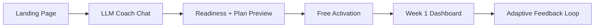

# Product Requirements Document (PRD)
## Nayth's Ironman Coach — AI Coaching Web App (MVP)

**Version:** 1.1  
**Date:** 13 June 2026  
**Status:** Draft  
**Product name:** Nayth's Ironman Coach

**Focused auth PRD:** `docs/Auth/PRD-Auth-flow.md`

---

## 1. Executive Summary

Nayth's Ironman Coach is a web-first AI coaching platform for long-course triathlon athletes. It generates personalized, periodized Ironman training plans across swim, bike, and run, adapts those plans based on athlete response, and provides an in-app AI coach for ongoing guidance.

This PRD covers the **web application MVP only**. Mobile (native iOS) and device integrations (Garmin, COROS, Apple Watch, TrainingPeaks) are explicitly out of scope for v1, but every product and technical decision must preserve a clean path to add them later without re-architecting.

**North star:** A new user understands the value in under 15 seconds, sees a personally relevant plan in under 5 minutes, and starts week 1 with minimal friction.

---

## 2. Problem Statement

Ironman training is complex: three disciplines, long macrocycles, fueling, recovery, and injury risk all interact. Generic plans fail because they are rigid and do not adapt to real life. Athletes either:

- Use spreadsheets or static PDF plans that do not respond to missed sessions or fatigue
- Pay for human coaches (expensive, not always available)
- Use apps like TrainingPeaks (powerful but not conversational or AI-native)

Nayth's Ironman Coach fills the gap: **evidence-based, adaptive, conversational coaching** that feels like talking to a real coach, delivered through a clean web experience.

---

## 3. Goals & Non-Goals

### 3.1 Goals (MVP)

| Goal | Success signal |
|------|----------------|
| Deliver a personalized Ironman plan from a conversational intake | User completes LLM coach chat and sees a plan preview in < 5 min |
| Layer strength training from onboarding context | Plan includes strength sessions scaled to background, equipment, and injury history |
| Show a usable training dashboard post-activation | User can view plan, filter by discipline, see past workouts |
| Enable ongoing AI coach chat | User can ask questions via slide-out chat panel |
| Adapt the plan based on feedback | System can hold, progress, or deload after week 1 signals |
| Ship free with zero signup friction | User starts week 1 without account creation |
| Architect for future monetization and mobile | Entitlement hooks, API-first backend, neutral workout model |

### 3.2 Non-Goals (MVP — deferred)

- Native iOS or Android app
- Pushing workouts to Garmin, COROS, Apple Watch, or TrainingPeaks
- Account creation, authentication, or paywall (built as optional layers)
- Calendar sync, device pairing, push notifications
- Human coach marketplace
- Social features, leaderboards, or community
- Strength/mobility video library (exercise names and structure only; no video content in MVP)
- Full nutrition tracking UI (coaching guidance in chat only)

---

## 4. Target Users

**Primary persona — Self-coached age-grouper**
- Training for first or repeat Ironman
- Has 8–14 hours/week available
- Uses a sports watch but does not need device sync in MVP
- Wants structure without hiring a coach
- Comfortable with a web app on desktop and mobile browser

**Secondary persona — Returning athlete**
- Coming back from injury or break
- Needs conservative onboarding and timeline realism checks

---

## 5. Coaching Philosophy (Product Foundation)

The product is built on an evidence-led coaching framework (see `ironman-coaching-framework.canvas.tsx`). Core principles that **must** be reflected in generated plans and adaptation logic:

1. **Durability first** — low-intensity dominant training (75–85% easy), progressive long sessions
2. **Race-specific periodization** — Prep → Base → Build → Peak → Taper, built backward from race date
3. **Four-pillar integration** — swim/bike/run, strength, fueling, recovery treated as one program
4. **Adaptive coaching loop** — weekly auto-adjustment + end-of-block review with explicit progress / hold / deload rules
5. **Discipline priorities** — bike durability central; conservative run progression; frequent swim technique

**Runna-inspired product patterns** (adapted for triathlon):
- Goal-aware conversational onboarding
- Dynamic calendar adaptation when workouts are missed
- Clear purpose tag on every workout
- Pacing and race-execution guidance
- Coach-in-the-loop override capability (via LLM chat in MVP)

---

## 6. User Journeys

### 6.1 New User — First Visit to Week 1



| Step | User job | Product requirement |
|------|----------|---------------------|
| 1. Landing | Understand value fast | Hero, social proof, single CTA; nav = logo + Log in (decorative, no action) |
| 2. LLM coach chat | Define goal and profile naturally | Conversational capture of race goal, date, fitness, injuries, strength background, available time, limiter discipline |
| 3. Chat outputs | Trust the plan is real | Auto-generate readiness verdict (green/amber/red), timeline realism, first 2 weeks + phase roadmap |
| 4. Free activation | Start immediately | One-tap start; optional local profile save; no forced signup |
| 5. Onboarding | Orient to dashboard | Brief guided tour of Overview, discipline filter, Workouts tab, coach chat |
| 6. Week 1 loop | Stay on track when life happens | Post-workout check-ins, missed-session handling, auto-adjust suggestions |

### 6.2 Returning User — Dashboard

1. Lands on **Training Overview** (default tab)
2. Sees full-season plan timeline with phase blocks (Base, Build, Peak, Taper)
3. Uses **All / Swim / Bike / Run / Strength** filter — applies to plan chart, current workout, and recent workouts preview
4. Opens **Workouts** tab for full past-workout history (filterable by discipline)
5. Opens **My Plan** for detailed weekly calendar view
6. Taps floating chat button → **Coach Chat** slide-out panel
7. Marks workouts complete and submits brief RPE/readiness feedback

### 6.3 Branch Logic

| Signal | System response |
|--------|-----------------|
| Timeline unrealistic | Propose adjusted race date or staged milestone plan |
| Injury/risk flags in chat | Route to conservative plan + education content |
| User exits mid-chat | Persist conversation locally; offer resume on return |
| Missed workouts in week 1 | Trigger "adapt my week" before user churns |
| High fatigue reported | Auto-reduce non-key load; protect priority sessions |

---

## 7. Feature Requirements

### 7.1 Landing Page (Public)

**Priority:** P0

| Requirement | Detail |
|-------------|--------|
| Layout | Single-page MVP; minimal nav (logo + Log in) |
| Log in button | Visible in nav for layout fidelity; **no-op in MVP** — click does nothing, no route change, no modal |
| Hero | Headline, subhead, primary CTA ("Build my plan"), secondary CTA ("See a sample week") |
| Trust bar | Social proof strip (race logos / athlete count placeholder) |
| Features | 3-card grid: Adaptive plans, Race-day pacing, Recovery tracking |
| Design | Light off-white (#FAFAF8), coral-orange accent (#FF5436), autosend.com-inspired typography and whitespace |
| Responsive | Mobile-friendly; desktop-first for MVP |

**Acceptance criteria:**
- [ ] Page loads in < 2s on 4G
- [ ] Primary CTA routes to LLM coach chat flow
- [ ] Log in button renders but performs no action on click
- [ ] No account required to start

---

### 7.2 LLM Coach Intake (Onboarding Chat)

**Priority:** P0

Replaces separate goal-selection and form-based intake. User speaks to an AI coach (powered by **OpenAI**) that gathers:

| Data point | Required | Notes |
|------------|----------|-------|
| Race goal | Yes | Finish, PR, return-from-break |
| Target race + date | Yes | Drives macrocycle length |
| Current weekly training hours | Yes | Volume calibration |
| Discipline limiter | Yes | Swim / bike / run |
| Injury history / constraints | Yes | Safety gating; also informs strength exercise selection |
| Strength training background | Yes | Prior experience, familiarity, equipment access (gym vs home) |
| Current strength routine | Yes | Frequency, types of movements, comfort with load |
| Strength-related injury flags | Yes | e.g. lower back, knee, shoulder — determines exercise restrictions |
| Available training days | Yes | Schedule placement |
| Experience level | Yes | Plan difficulty |
| Confidence / motivation | Optional | Tone calibration |

The coach should ask about strength and injury history **naturally within the conversation**, not as a separate form section. Example prompts: "Do you have much experience with strength training?" / "Any injuries I should know about when planning your gym work?"

**Strength prescription (derived from chat):**

| Profile signal | Strength plan |
|----------------|---------------|
| No strength background + no injuries | Introductory 1×/week; bodyweight and basic movements; focus on durability |
| Some strength background + no major injuries | 2×/week in Prep/Base; maintenance 1×/week in Build/Peak |
| Experienced lifter + no injuries | 2×/week year-round with phase-adjusted intensity |
| Any injury flags (back, knee, shoulder, etc.) | Modified exercise selection; avoid aggravating movements; conservative loading |
| Low weekly hours (<8h) | 1×/week strength max; short sessions (20–30 min) |
| High run injury risk | Prioritize posterior chain and single-leg stability; no heavy axial loading early |

Strength sessions appear in the generated plan as `sport: strength` workouts with structured exercises, sets/reps, and purpose tags. They are scheduled around key SBR sessions to minimize interference (typically after easy days or same day as swim).

**Outputs (generated from chat, not separate steps):**

1. **Readiness verdict** — green / amber / red with plain-language explanation
2. **Timeline realism** — confirm or suggest adjusted target
3. **Plan preview** — first 2 weeks of workouts + macrocycle phase roadmap

**Acceptance criteria:**
- [ ] Chat feels conversational, not form-like (max ~8–12 exchanges)
- [ ] Coach asks about strength background and injury history before plan generation
- [ ] Generated plan includes strength sessions scaled to athlete profile
- [ ] Outputs reference specific details from the conversation
- [ ] Amber/red verdicts still allow user to proceed with adjusted plan
- [ ] Conversation state persists in browser if user navigates away

---

### 7.3 Training Dashboard — Overview

**Priority:** P0

| Component | Behavior |
|-----------|----------|
| Sidebar nav | Overview (active), My Plan, Workouts, Progress |
| Top bar | Page title + race countdown chip ("Ironman Nice • 14 weeks to go") |
| Discipline filter | Segmented control: All / Swim / Bike / Run / Strength — filters entire view |
| Season plan card | Training-load area chart across phases; title reflects active filter |
| Current workout card | Today's or next scheduled session for filtered discipline; structured steps, zones, duration/distance/TSS |
| Recent workouts preview | Last 5 completed sessions for active filter; link to Workouts tab |
| Coach chat trigger | Floating coral button bottom-right |

**Discipline color system:**
- Swim: blue
- Bike: green
- Run: orange/coral
- Strength: purple

**Acceptance criteria:**
- [ ] Filter change updates plan chart, workout card, and recent list within 200ms
- [ ] Plan chart shows phase labels (Base 1, Base 2, Build, Peak, Taper, Race Day)
- [ ] Empty states handled when no workouts exist for a filter

---

### 7.4 My Plan Tab

**Priority:** P1

| Requirement | Detail |
|-------------|--------|
| Weekly calendar | Scrollable week-by-week view of all scheduled sessions |
| Session cards | Sport icon, title, duration, purpose tag, key/not-key indicator |
| Discipline filter | Same global filter applies |
| Workout detail | Click session → expand structured steps, targets, fueling notes |

---

### 7.5 Workouts Tab (Past Workouts)

**Priority:** P0

| Requirement | Detail |
|-------------|--------|
| List view | Chronological completed sessions with date, discipline, title, duration, completion status |
| Filtering | By discipline (inherits global filter) and date range |
| Detail view | Actual vs planned metrics (manual entry in MVP), RPE, notes |
| Completion | Mark complete from Overview or My Plan; appears in history |

**Acceptance criteria:**
- [ ] Completed workouts appear within 1s of marking done
- [ ] List supports 100+ entries with virtualized scroll

---

### 7.6 Coach Chat (Slide-Out Panel)

**Priority:** P1

| Requirement | Detail |
|-------------|--------|
| UI | Right slide-out overlay; dimmed backdrop; close (X) button |
| Trigger | Floating action button on all dashboard views |
| Context | OpenAI-powered; has access to athlete profile, current plan, recent completions |
| MVP scope | Q&A about workouts, pacing, fueling, strength exercises, schedule changes; exact tool-calling TBD |
| Persistence | Chat history per browser session; persisted with profile when save enabled |

**Deferred chat capabilities:**
- Plan modification via chat (v1.1)
- Voice input
- Proactive coach messages

---

### 7.7 Adaptation Engine

**Priority:** P1

Weekly review based on signals collected post-workout:

| Signal state | Decision | Plan update |
|--------------|----------|-------------|
| All green (10–14 days) | Progress | +5–10% load or denser key sessions |
| Mixed (1–2 warning flags) | Hold | Stable load; trim optional volume 10–20% |
| Red (3+ flags) | Deload | −30–50% load for 3–7 days |
| Run orthopedic stress | Bike-substitute | Reduce run intensity; add bike endurance |
| Fueling intolerance | Gut training block | Step carb targets gradually |

**MVP implementation:** Rule-based engine with LLM-generated explanations. User sees "Your coach adjusted this week" with rationale.

**Acceptance criteria:**
- [ ] Adaptation triggers after 3+ logged sessions or explicit fatigue report
- [ ] User can accept or dismiss suggested changes
- [ ] All adaptations logged for audit and future ML training

---

### 7.8 Progress Tab

**Priority:** P2 (MVP placeholder)

| Requirement | Detail |
|-------------|--------|
| Consistency score | % key sessions completed |
| Volume trend | Weekly hours by discipline (stacked bar) |
| Phase indicator | Current macrocycle phase |
| Readiness trend | Self-reported readiness over time |

---

## 8. Free Access & Future Monetization

MVP ships **fully free** with no account or paywall. The following must be built now to avoid rework:

| Concern | MVP approach | Future hook |
|---------|--------------|-------------|
| Identity | Anonymous browser profile (localStorage + optional UUID) | Supabase auth when accounts ship |
| Entitlements | All features `tier: free` | `EntitlementService.check('feature')` gate |
| Telemetry | Log feature usage events (chat messages, adaptations, plan views) | Inform paywall packaging |
| Profile save | Optional "Save my plan" → email or magic link later | Account creation upsell |
| Premium candidates | Flag in telemetry: advanced analytics, unlimited chat, device sync, human coach | Tier definition |

---

## 9. Data Model (Product-Level)

Core entities the web app must manage (backend owns truth; web is a client):

```
AthleteProfile
  - id, createdAt
  - goalType, raceName, raceDate
  - weeklyHours, limiterDiscipline, injuryFlags
  - strengthBackground (none|beginner|intermediate|experienced)
  - strengthEquipment (gym|home|minimal)
  - strengthFrequency (0|1|2 per week)
  - strengthRestrictions (e.g. no overhead press, no heavy squats)
  - experienceLevel, preferredTrainingDays
  - readinessVerdict

TrainingPlan
  - id, athleteId, raceDate
  - phases: [Phase]
  - currentPhase, currentWeek

Phase
  - name (Prep|Base|Build|Peak|Taper)
  - startWeek, endWeek, objective

Workout (canonical internal model)
  - id, planId, scheduledDate
  - sport: swim|bike|run|strength|brick
  - title, description, purposeTag
  - isKeySession: boolean
  - steps: [WorkoutStep]
  - targets: { duration, distance, tss, zones }
  - status: planned|completed|skipped|adapted

WorkoutStep
  - type: warmup|work|recovery|repeat|cooldown
  - duration|distance, targetZone, notes
  - repeatCount, nestedSteps (for repeat blocks)

WorkoutCompletion
  - workoutId, completedAt
  - actualDuration, actualDistance, rpe (1-10)
  - readinessScore, notes, fatigueFlags

AdaptationEvent
  - athleteId, triggeredAt, decision (progress|hold|deload)
  - signals, changesApplied, userAccepted

ChatConversation
  - id, athleteId, context (onboarding|coaching)
  - messages: [{ role, content, timestamp }]

Entitlement
  - athleteId, feature, tier, grantedAt
```

This model is intentionally **neutral** — not Garmin FIT, TrainingPeaks, or Apple WorkoutKit format. Export adapters are added later.

---

## 10. Non-Functional Requirements

| Category | Requirement |
|----------|-------------|
| Performance | Dashboard interactive in < 1s; chat first token < 2s |
| Availability | 99.5% uptime target (Supabase + Netlify SLA) |
| Security | No PII in client logs; LLM prompts sanitized; HTTPS everywhere |
| Privacy | GDPR-ready data export/delete hooks (even for anonymous profiles) |
| Accessibility | WCAG 2.1 AA for core flows; keyboard-navigable dashboard |
| Browser support | Chrome, Safari, Firefox, Edge (last 2 versions); iOS Safari |
| Responsive | Usable on mobile browser (future native app shares API) |

---

## 11. Design System

| Token | Value |
|-------|-------|
| Background | #FAFAF8 |
| Primary accent | #FF5436 (coral-orange) |
| Text primary | Near-black |
| Text secondary | Muted grey |
| Swim | Blue |
| Bike | Green |
| Run | Orange |
| Card style | White, rounded, soft shadow |
| Typography | Clean sans-serif (Inter or similar) |
| Buttons | Pill-shaped; solid black or coral primary |

Reference mockups: `assets/ironman-coach-landing-mockup-v2.jpg`, `assets/ironman-coach-dashboard-mockup-v2.jpg`

---

## 12. MVP Release Phases

### Phase 0 — Foundation (Weeks 1–2)
- Repo scaffold, design system, data model, API skeleton
- Anonymous profile persistence
- Landing page

### Phase 1 — Onboarding (Weeks 3–4)
- LLM coach chat flow
- Plan generation from chat outputs
- Readiness verdict + plan preview UI

### Phase 2 — Dashboard Core (Weeks 5–7)
- Overview with discipline filter
- My Plan weekly view
- Workout completion logging
- Workouts history tab

### Phase 3 — Intelligence (Weeks 8–9)
- Coach chat slide-out
- Rule-based adaptation engine
- Progress tab (basic)

### Phase 4 — Polish (Week 10)
- Responsive pass
- Error states, loading, empty states
- Analytics + error monitoring
- Beta launch

---

## 13. Success Metrics

| Metric | Target (90 days post-launch) |
|--------|------------------------------|
| Landing → chat start | > 40% |
| Chat → plan preview | > 70% |
| Plan preview → week 1 activation | > 50% |
| Week 1 retention (≥3 sessions logged) | > 35% |
| Adaptation acceptance rate | > 60% |
| Coach chat engagement (≥1 message in week 1) | > 25% |

---

## 14. Risks & Mitigations

| Risk | Impact | Mitigation |
|------|--------|------------|
| LLM generates unsafe training load | Athlete injury | Readiness gating, rule-based guardrails on volume/intensity ceilings |
| Generic-feeling plans | Low trust | Chat outputs must cite user inputs; show phase rationale |
| No account = data loss | Churn on device switch | Early "save plan" prompt; export plan as PDF |
| Scope creep into device sync | Delays MVP | Strict non-goals; adapter pattern documented in ADR |
| LLM cost at scale | Unit economics | Cache plan generation; limit chat tokens in MVP |

---

## 15. Resolved Decisions

| Decision | Resolution |
|----------|------------|
| Product name | **Nayth's Ironman Coach** |
| LLM provider | **OpenAI** (server-side via API; model TBD, e.g. `gpt-4o`) |
| Log in button (MVP) | **Fake/no-op** — visible in nav, click does nothing |
| Strength in plans | **Included** — prescribed from onboarding conversation based on strength background and injury history |

## 16. Open Questions

1. **Manual vs device-reported completion** — MVP is manual only; confirm?
2. **Sample week CTA** — Static demo plan or interactive preview?
3. **OpenAI model selection** — `gpt-4o` vs `gpt-4o-mini` for cost/latency tradeoff?

---

## 17. References

- [Ironman Coaching Framework Canvas](../canvases/ironman-coaching-framework.canvas.tsx)
- [New User Website Flow Canvas](../canvases/new-user-website-flow.canvas.tsx)
- [UI Mockups — Landing v2](../assets/ironman-coach-landing-mockup-v2.jpg)
- [UI Mockups — Dashboard v2](../assets/ironman-coach-dashboard-mockup-v2.jpg)
- Prior research: Garmin Training API, TrainingPeaks Partner API (deferred integrations)
